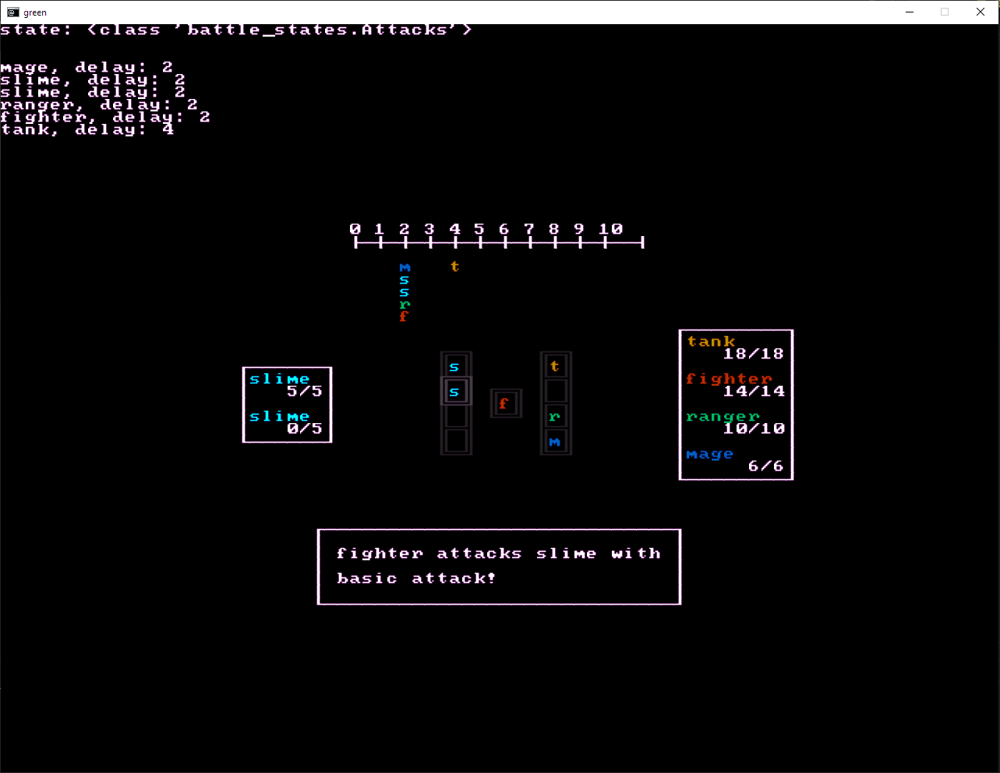

2d battle system test in python using bearlibterminal for (text) graphics

### Please note
A [code page 437](https://en.wikipedia.org/wiki/Code_page_437) tileset with 8x8 characters needs to be be placed in the same directory as with the python files.

This code from `green.py` can be edited to change the file that is used. -> `FONT_PATH: str = os.path.join(os.getcwd(), 'CGA8x8thick.png')`

_I'm using 'CGA8x8thick.png' from https://dwarffortresswiki.org/Tileset_repository as a tileset, but I opted to not upload it out of caution as it wasn't made by me._

